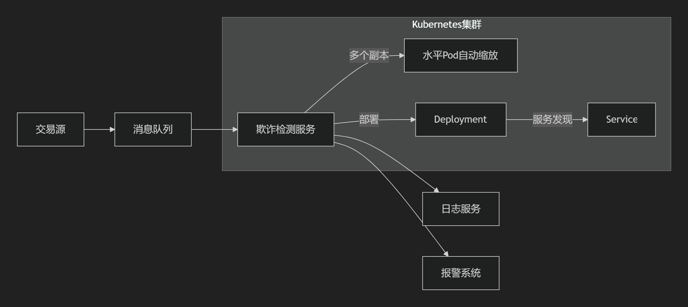

# FraudDetection

#### 介绍
实时欺诈检测系统使用基于规则的机制检测欺诈交易，在Kubernetes集群上运行。

#### 软件架构

1、交易源：生成金融交易的系统
2、消息队列：处理传入交易（阿里云消息服务）
3、欺诈检测服务：核心处理逻辑（Spring Boot3应用）
4、高可用组件：
Deployment：确保Pod实例运行
HPA：基于CPU/内存自动扩展
Service：服务发现和负载均衡
5、日志服务：云原生日志（阿里云SLS）
6、报警系统：通知可疑交易

#### 设计说明
1. **基于规则的检测**：
    - 快速简单实现
    - 易于理解和维护
    - 可扩展为复杂的规则引擎

2. **消息队列集成**：
    - 提供异步处理和解耦
    - 提高系统弹性
    - 支持消息回放

3. **Kubernetes设计**：
    - Deployment确保Pod副本可用性
    - HPA根据负载自动扩展
    - Service提供负载均衡
    - Readiness/Liveness探针检查健康状态

4. **云服务集成**：
    - 云消息队列处理事务
    - 云日志服务集中管理日志
    - 云监控指标支持性能优化

5. **弹性策略**：
    - 自动重试失败消息
    - 错误隔离
    - 故障转移到备用区域

该系统为实时欺诈检测提供了一个健壮的基础架构，可以根据业务需求扩展规则和算法复杂度。

#### 开发说明
1. 使用Java17+作为基础版本
2. 使用SpringBoot3作为基础框架
3. 使用kafka-clients和SpringKafka作为kafka消费端的监听

#### 测试说明
1. 使用JUnit做单元测试
2. 使用Jmeter做性能测试
3. 在docs文件下中有相关的测试覆盖率报告和弹性测试报告

#### 云环境配置说明

1. 前置要求
- 阿里云ACR镜像服务(Docker镜像服务)
- 阿里云ACK服务(Kubernetes集群)
- 阿里云Kafka消息服务
- 阿里云SLS日志服务
2. 配置ACR
- 需要在阿里云上购买和配置，具体参考本项目下的docs文件下的[ACR使用指南]
3. 配置ACK
- 需要在阿里云上购买和配置，具体参考本项目下的docs文件下的[ACK部署指南]

#### 部署说明
1. 构建项目
   通过idea或者mvn工具将拉取到的代码打包成jar包
2. 上传Jar包
   可以将上一步生成的Jar包上传到代码仓库
3. 生成Docker镜像
   上传Jar包到代码仓库以后，ACR会自动打包Docker镜像
4. 部署Docker镜像到阿里云ACK
   在阿里云上的Docker镜像页面通过部署功能把镜像部署到ACK上