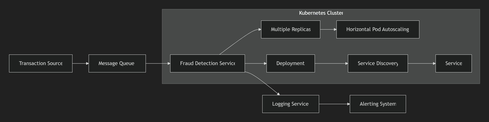

# FraudDetection
#### Introduction
The real-time fraud detection system uses a rule-based mechanism to detect fraudulent transactions and runs on a Kubernetes cluster.
#### Software Architecture

1. Transaction source: System for generating financial transactions
2. Message queue: Processing incoming transactions (Alibaba Cloud messaging service)
3. Fraud detection service: core processing logic (Spring Boot3 application)
4. Highly available components:
   Deployment: Ensure Pod instances are running
   HPA: CPU/Memory based Automatic Expansion
   Service: Service discovery and load balancing
5. Log service: Cloud native logs (Alibaba Cloud SLS)
6. Alarm system: Notify suspicious transactions
#### Design Description
1. **Rule based detection**:
   -Quick and easy implementation
   -Easy to understand and maintain
   -Scalable into a complex rule engine
2. **Message queue integration**:
       -Provide asynchronous processing and decoupling
       -Improve system resilience
       -Support message playback
3. **Kubernetes Design**:
   -Deployment ensures Pod replica availability
   -HPA automatically expands based on load
   -Service provides load balancing
   -Readiness/Liveness probe checks health status
4. **Cloud Service Integration**:
       -Cloud message queue processing transactions
       -Cloud log service centralized management of logs
       -Cloud monitoring metrics support performance optimization
5. **Elastic Strategy**:
       -Automatic retry failure message
       -Error isolation
       -Fault transfer to backup area
       This system provides a robust infrastructure for real-time fraud detection, which can expand rules and algorithm complexity according to business needs.
#### Development Description
1. Use Java17+as the base version
2. Use SpringBoot3 as the basic framework
3. Use Kafka clients and SpringKafka as listening devices for Kafka consumers
   ####Test instructions
1. Use JUnit for unit testing
2. Use Jmeter for performance testing
3. There are relevant test coverage reports and resilience test reports in the docs file
#### Cloud Environment Configuration Instructions
1. Pre requirements
   -Alibaba Cloud ACR Image Service (Docker Image Service)
   -Alibaba Cloud ACK Service (Kubernetes Cluster)
   -Alibaba Cloud Kafka Message Service
   -Alibaba Cloud SLS Log Service
2. Configure ACR
   -Need to purchase and configure on Alibaba Cloud, please refer to the [ACR User Guide] in the docs file of this project for details
3. Configure ACK
   -Need to purchase and configure on Alibaba Cloud, please refer to the [ACK Deployment Guide] in the docs file of this project for details
#### Deployment instructions
1. Build the project
   Package the pulled code into a jar file using the idea or mvn tool
2. Upload Jar package
   You can upload the Jar package generated in the previous step to the code repository
3. Generate Docker images
   After uploading the Jar package to the code repository, ACR will automatically package the Docker image
4. Deploy Docker image to Alibaba Cloud ACK
   Deploy the image to ACK through the deployment function on the Docker image page on Alibaba Cloud